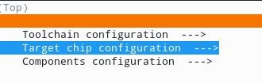
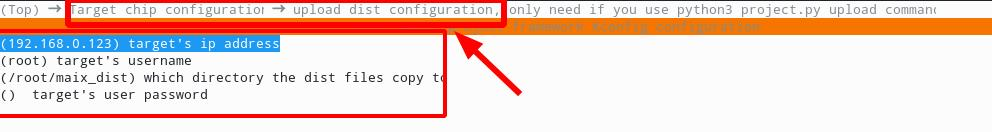

 libmaix
=========

带硬件 AI 加速模型推理库，一起构建更美好的 AIOT ～


支持的硬件平台：

* V831


## 编译构建


目前仅在 Ubuntu18.04 和 Ubuntu20.04 测试通过

* 安装依赖

```
apt install build-essential cmake python3 sshpass git
```

* 检查 `cmake` 版本， **应该 >= `v3.9`**

执行命令：

```
cmake --version
```

`cmake` 的版本至少需要是 `v3.9`, 否则请从 [cmake 官网](https://cmake.org/download/) 下载安装包安装

* 下载并设置工具链（toolchain）

| 架构(Arch) | 工具链(toolchain) | 前缀(prefix) |
| ---- | --------- | ------ |
| v83x | [toolchain-sunxi-musl-pack-2021-01-09.tar.xz](https://dl.sipeed.com/shareURL/MaixII/SDK/Toolchain) 或者 </br> [github](https://github.com/sipeed/libmaix/releases/download/v0.1.0/toolchain-sunxi-musl-pack-2021-01-09.tar.xz) | arm-openwrt-linux-muslgnueabi- |
| r329 | [linaro aarch64-linux-gnu](https://releases.linaro.org/components/toolchain/binaries/7.5-2019.12/aarch64-linux-gnu/gcc-linaro-7.5.0-2019.12-x86_64_aarch64-linux-gnu.tar.xz) | aarch64-linux-gnu- |

解压到 `/opt/` 目录

```shell
tar -Jxvf toolchain-sunxi-musl-pack-2021-01-09.tar.xz -C /opt
```

然后通过 `ls /opt` 命令，在 `/opt` 目录下看到 `toolchain-sunxi-musl` 文件夹

* 获取 `libmaix` 源码

```
git clone https://github.com/sipeed/libmaix --recursive
```
注意这里用了`--recursive`参数， 因为工程中使用了子模块，子模块的好处是各个工程分开管理，比如这里用了`Kconfiglib`作为子模块，提供`menuconfig`带界面的功能配置功能

**注意如果不更新子模块，将无法通过编译！！！**

如果克隆的时候忘记加这个参数了，也可以再使用下面这个命令来更新子模块：
```
git submodule update --init --recursive
```
另外，当远程仓库更新了，用户也需要使用以下命令来更新代码（即同时更新子模块代码）：
```shell
git pull --recursive
```
或者：
```
git pull
git submodule update --init --recursive
```

* 设置工程


```
cd libmaix
cd examples/hello-world
```

每次更改工具链， 必须 先清一次临时文件;
```
python3 project.py distclean
```

根据 CPU 架构选择工具链和前缀
```
python3 project.py --toolchain /opt/toolchain-sunxi-musl/toolchain/bin --toolchain-prefix arm-openwrt-linux-muslgnueabi- config
```
> 或者只配置后缀 `python3 project.py --toolchain-prefix aarch64-linux-gnu- config`

最后配置组件配置项
```
python3 project.py menuconfig
```

选择需要的模块和配置， 以及也可以设置目标开发板（系统）的 `IP` 和 用户相关信息，这会在上传可执行文件时用到




第一次编译，可以只使用默认配置即可，也可以使用下属配置选择自己系统的编译链（）。

## R329

python3 project.py --toolchain /opt/r329_linux_x86_python3.9_toolchain/bin --toolchain-prefix aarch64-linux-gnu- config

python3 project.py menuconfig

然后在 menuconfig 勾选 R329 平台的动态链接库 (Target chip configuration  ---> Chip architecture (compile for arch R329)  ---> (X) compile for arch R329)

## Desktop

python3 project.py --toolchain /usr/bin --toolchain-prefix x86_64-linux-gnu- config

和 R329 同理，改成 desktop 就行。

## V83x

python3 project.py --toolchain /opt/toolchain-sunxi-musl/toolchain/bin/ --toolchain-prefix arm-openwrt-linux-muslgnueabi- config

然后按`q` 按键退出配置， 选择 `yes` 来保存配置


* 构建 `hello-world` 例程

```
python3 project.py build
```

然后可以在 `dist` 目录看到 `hello-world` 可执行文件

* 上传可执行文件到目标开发板（系统）

你可以手动拷贝整个`dist`文件夹到目标系统文件系统， 比如使用 `scp`

你也可以在 menuconfig 中配置好目标系统信息， 然后执行命令上传:
```
python3 project.py upload
```
> 这使用了 `sshpass` + `scp` 进行传输，
> 但是 `sshpass` 在遇到 `ssh key` 为识别时不会让用户输入密码，而是直接不报错退出，
> 可以在电脑执行`sudo sh -c "echo StrictHostKeyChecking no >>/etc/ssh/ssh_config"` 来关闭检查，
> 或者`menuconfig`中不填密码，就不会使用`sshpass`了，或者手动使用`scp`拷贝一次就好了


或者直接传参数:
```
python3 project.py upload --target root@192.168.0.123:/root/maix_dist --passwd 123
```

* 清除构建中间文件

Clean temp build files:
```
python3 project.py clean
```

清除所有中间文件， 以及使用`python3 project.py menuconfig` 选择的配置：
```
python3 project.py distclean
```

* 执行可执行文件

拷贝`dist` 目录下所有文件， 包括一些库， 比如 `*.a` 或者 `*.so`, 然后执行 `./start_app.sh`


## 创建自己的工程

有两种方法：

### 方法 1. 在 libmaix SDK 目录下直接创建工程

* 直接拷贝 `examples/hello-world` 中的内容到 `examples/my-project`

* 或者新创建一个文件夹，比如 拷贝 `examples/hello-world` 的内容到 `projects/my-project`


### 方法 2. 在文件系统任何地方放工程

* 克隆 `libmaix` 到本地，比如 `/home/sipeed/libmaix`

* 然后在终端导出变量 `export LIBMAIX_SDK_PATH=/home/neucrack/my_SDK`， 可以把语句放到  `~/.bashrc` or `~/.zshrc` 文件，这样就不用每次打开终端都执行一遍了

* 然后在任意文件夹下创建一个目录`my-project`, 拷贝 `example/hello-world` 的内容到 `/home/sipeed/my_projects/my-project`

* 最后到 `/home/sipeed/my_projects/my-project` 目录 编译：`python3 project.py build`, 可以先执行一遍 `python3 project.py distclean` 来清除之前的构建中间文件


### 添加源码

* 对于简单工程来说， 只需要在 `main/src` 和 `main/include` 添加代码.
* 你也可以添加自己的组件，拷贝 `main` 文件夹 到一个新的目录比如 `examples/my-project/mylib`, 然后编辑 `examples/my-project/mylib/CMakeLists.txt` 来添加源文件, 同时需要编辑 `examples/my-project/main/CMakeLlist` 文件，修改：
```
list(APPEND ADD_REQUIREMENTS libmaix)
```
变成
```
list(APPEND ADD_REQUIREMENTS libmaix mylib)
```

更多关于工程编译框架参考 [c_cpp_project_framework](https://github.com/Neutree/c_cpp_project_framework) 中的说明


## 开源协议

遵循 **MIT** 开源协议， 详情请看 [LICENSE](./LICENSE)


