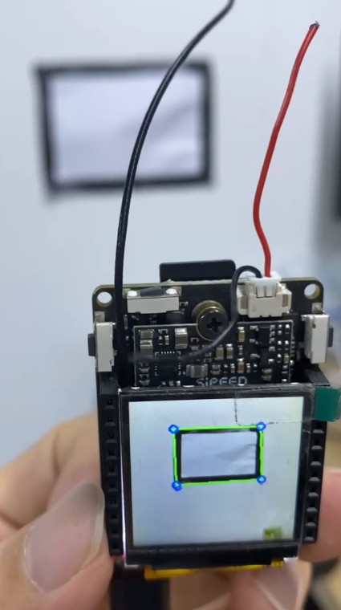

OpenCV Usage
=====

This is an example of using OpenCV with libmaix.

by default code use opencv to get balck rectangle line, like this:



## Build

See [README.md](../../README.md) for build instructions and compile `examples/hello-world` first.

Then build this example:

```
python project.py --toolchain /opt//opt/toolchain-sunxi-musl/toolchain/bin --toolchain-prefix arm-openwrt-linux-muslgnueabi- config
python project.py build
```

## imlib (OpenMV libs)

If you want to use OpenMV's lib like `find_blobs`, you can refer to [this API list](https://github.com/sipeed/MaixPy3/blob/c6b5c419a9c547f1f42c686020eb0e4cdb3f93cf/ext_modules/_maix_image/py_maix_image.cpp#L105) to find what you want, then find the corresponded C function, e.g. `.def("binary", &maix_image::_binary,` point to [_binary](https://github.com/sipeed/MaixPy3/blob/c6b5c419a9c547f1f42c686020eb0e4cdb3f93cf/ext_modules/_maix_image/_maix_image.cpp#L926) function, then you use this `binary` method in your C code!


